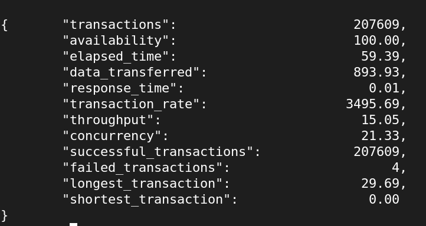

# Webserv

Webserv is an HTTP server built from scratch based on the features of Nginx. This project is part of the 42 Network curriculum and aims to provide hands-on experience with networking, HTTP protocols, multiplexing, and server management.


## Features

- **HTTP Protocol Handling**: Supports GET, POST, and DELETE methods for handling web requests.
- **CGI Script Handling**: Executes Common Gateway Interface (CGI) scripts to dynamically generate content.
- **Static File Serving**: Serves static files (HTML, JS, images) from a specified directory.
- **File Uploading**: Allows users to upload images to the server.
- **Custom Error Pages**: Displays user-defined error pages for common HTTP errors (404, 500, etc.).
- **Configuration File**: Uses a configuration file for server settings, including port, autoindex, and location blocks.
- **Concurrency**: Supports handling multiple requests simultaneously through multi-threading.
- **Logging**: Implements logging for incoming requests and errors for easier debugging.

## Installation

To compile and run Webserv, follow these steps:

1. **Clone the repository**:
   ```bash
   git clone git@github.com:Jackdehaan/webserv.git
   cd webserv

2. **Compile Webserver**:
   ```bash
   make
3. **Deploy Webserver**:
   ```bash
   ./webserv files/config_files/default.conf

## Webserver performance within 60sec with siege

